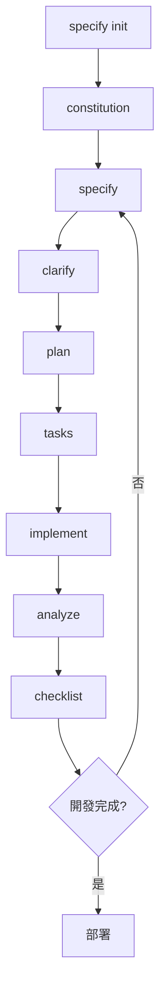

[spec-kit](https://github.com/github/spec-kit) 是 GitHub 開發的一套工具，用於幫助開發團隊建立和維護專案規範，透過 AI 協助產生專案文件、測試計畫和開發任務。

## 環境準備

### 安裝 uv

uv 是一個快速的 Python 套件管理工具，我們使用它來安裝 spec-kit。

官方安裝文件：https://docs.astral.sh/uv/getting-started/installation/

```sh
curl -LsSf https://astral.sh/uv/install.sh | sh
```

將 uv 加入到環境變數：

```sh
export PATH="$HOME/.local/bin:$PATH"
```

建議將上述路徑加入到 `.bashrc` 或 `.zshrc` 中，以便永久生效。

### 安裝 spec-kit

使用 uv 從 GitHub 安裝 specify-cli：

```sh
uv tool install specify-cli --from git+https://github.com/github/spec-kit.git
```

## 初始化專案

在專案根目錄執行初始化命令：

```sh
specify init
```

這會在專案中建立 `.speckit/` 目錄，包含必要的設定檔案。

## GitHub Copilot 整合

spec-kit 與 GitHub Copilot 緊密整合，透過特殊的指令可以快速產生各種專案文件。

### constitution - 制定專案原則

constitution 用於建立專案的核心原則和開發指導方針。

**中文版本：**

```
/speckit.constitution 請制定原則，強調程式碼品質、測試標準、用戶體驗一致性，以及效能需求，同時確保所有規範皆以 minimum viable product (MVP) 為核心，不要 overdesign，並且一律使用正體中文。
```

**英文版本：**

```
/speckit.constitution Create principles focused on code quality, testing standards, user experience consistency, and performance requirements, while ensuring everything is based on the minimum viable product (MVP) concept, avoid overdesign, and always use Traditional Chinese for all specifications.
```

```
/speckit.constitution Create principles focused on code quality, testing standards, user experience consistency, and performance requirements, while ensuring everything is based on the minimum viable product (MVP) concept, avoid overdesign.
```

```
/speckit.constitution 

Add a new rule to the constitution. Keep this doc in English only.

All specifications, plans, and user-facing documentation MUST be written in Traditional Chinese (zh-TW)
```

這個指令會產生 `.speckit/constitution.md` 檔案，包含專案的核心原則。

### specify - 建立功能規格

specify 指令用於產生詳細的功能規格文件：

```
/speckit.specify 建立一個應用程式，包含用戶註冊、登入、個人資料管理功能，使用 React 和 Node.js 技術棧
```

你也可以參考已經寫好的 spec 檔案來產生新的規格：

```
/speckit.specify 參考 user-authentication.spec.md，新增雙因子驗證功能
```

### clarify - 澄清需求

當規格不夠明確時，使用 clarify 指令來澄清細節：

```
/speckit.clarify 用戶註冊流程中的電子郵件驗證機制需要更詳細的說明
```

或是直接輸入

```
/speckit.clarify
```

這會幫助你：
- 識別模糊的需求
- 補充缺失的細節
- 確保團隊對需求有一致的理解

### plan - 制定開發計畫

plan 指令根據規格文件產生開發計畫：

```
/speckit.plan 根據 user-management.spec.md 制定開發計畫
```

```
/speckit.plan
```

產生的計畫包含：
- 開發階段劃分
- 時程安排
- 資源分配
- 風險評估

### tasks - 拆解開發任務

tasks 指令將計畫拆解成具體的開發任務：

```
/speckit.tasks 將用戶註冊功能拆解成可執行的開發任務
```

每個任務包含：
- 明確的功能描述
- 驗收條件
- 預估工時
- 相依關係

### analyze - 分析現有程式碼

analyze 指令用於分析現有的程式碼結構和品質：

```
/speckit.analyze 分析目前的用戶管理模組，檢查是否符合我們的規格要求
```

這個指令會：
- 檢查程式碼是否符合規格
- 識別潛在的問題和改進空間
- 提供程式碼品質評估
- 建議重構方向

使用範例：
```
/speckit.analyze src/components/UserProfile.js 檢查是否符合用戶資料管理規格
```

### implement - 實作建議

implement 指令根據規格提供具體的實作建議：

```
/speckit.implement 根據用戶註冊規格，提供 React 組件的實作建議
```

這會產生：
- 詳細的實作步驟
- 程式碼範例和模板
- 技術選型建議
- 測試策略

使用範例：
```
/speckit.implement 實作雙因子驗證功能，使用 TOTP 演算法
```

### checklist - 產生檢查清單

checklist 指令根據規格和任務產生檢查清單，確保開發過程的完整性：

```
/speckit.checklist 為用戶註冊功能產生完整的檢查清單
```

典型的檢查清單包含：

**開發階段：**
- [ ] 完成 UI 設計稿
- [ ] 實作前端表單驗證
- [ ] 建立後端 API 端點
- [ ] 實作資料庫操作
- [ ] 完成單元測試
- [ ] 完成整合測試

**測試階段：**
- [ ] 功能測試通過
- [ ] 效能測試符合標準
- [ ] 安全性檢查完成
- [ ] 無障礙性測試通過
- [ ] 跨瀏覽器相容性測試

**部署階段：**
- [ ] 程式碼審查完成
- [ ] 文件更新完成
- [ ] 環境設定確認
- [ ] 監控設定完成
- [ ] 回滾計畫準備

使用範例：
```
/speckit.checklist 為整個專案產生上線前檢查清單
```

## 工作流程建議

1. **初始化專案**：使用 `specify init` 建立專案結構
2. **制定原則**：使用 `constitution` 建立開發準則
3. **撰寫規格**：使用 `specify` 定義功能需求
4. **澄清細節**：使用 `clarify` 補充不明確的部分
5. **制定計畫**：使用 `plan` 規劃開發流程
6. **拆解任務**：使用 `tasks` 建立具體的工作項目
7. **分析現況**：使用 `analyze` 檢查現有程式碼
8. **實作指導**：使用 `implement` 獲得實作建議
9. **品質確保**：使用 `checklist` 確保開發品質

### 完整開發循環



## 檔案結構

spec-kit 會在專案中建立以下檔案結構：

```
.speckit/
├── constitution.md          # 專案原則
├── specs/                   # 功能規格目錄
│   ├── feature-1.spec.md
│   └── feature-2.spec.md
├── plans/                   # 開發計畫目錄
│   └── development.plan.md
├── tasks/                   # 任務目錄
│   ├── sprint-1.tasks.md
│   └── sprint-2.tasks.md
├── analysis/                # 程式碼分析報告
│   ├── code-review.md
│   └── quality-assessment.md
├── implementation/          # 實作指南
│   ├── frontend-guide.md
│   └── backend-guide.md
└── checklists/             # 檢查清單
    ├── development.checklist.md
    ├── testing.checklist.md
    └── deployment.checklist.md
```

## 常用指令速查

| 指令 | 用途 | 範例 |
|------|------|------|
| `constitution` | 建立專案原則 | `/speckit.constitution 制定程式碼品質標準` |
| `specify` | 撰寫功能規格 | `/speckit.specify 建立用戶管理系統` |
| `clarify` | 澄清需求細節 | `/speckit.clarify 登入流程的安全性要求` |
| `plan` | 制定開發計畫 | `/speckit.plan 規劃三個月的開發時程` |
| `tasks` | 拆解開發任務 | `/speckit.tasks 將登入功能分解為具體任務` |
| `analyze` | 分析程式碼 | `/speckit.analyze 檢查現有 API 設計` |
| `implement` | 實作建議 | `/speckit.implement 提供 JWT 驗證實作方案` |
| `checklist` | 產生檢查清單 | `/speckit.checklist 建立部署前檢查項目` |

## 最佳實踐

1. **保持簡潔**：遵循 MVP 原則，避免過度設計
2. **持續更新**：隨著專案進展更新規格文件
3. **團隊協作**：讓所有團隊成員參與規格制定過程
4. **版本控制**：將 `.speckit/` 目錄納入版本控制
5. **定期檢視**：定期檢視和更新專案原則

## 小結

spec-kit 是一個強大的專案規範化工具，能夠幫助開發團隊：
- 建立清晰的專案架構
- 制定一致的開發標準
- 提升團隊協作效率
- 確保專案品質

透過與 GitHub Copilot 的整合，可以大幅提升文件撰寫和專案規劃的效率。


